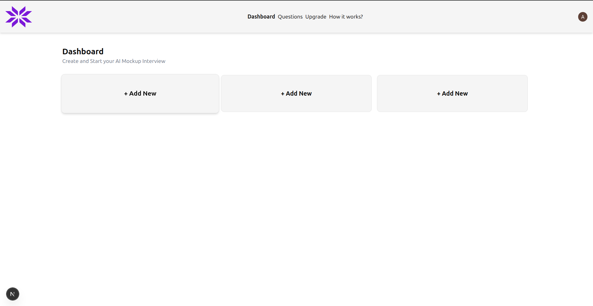
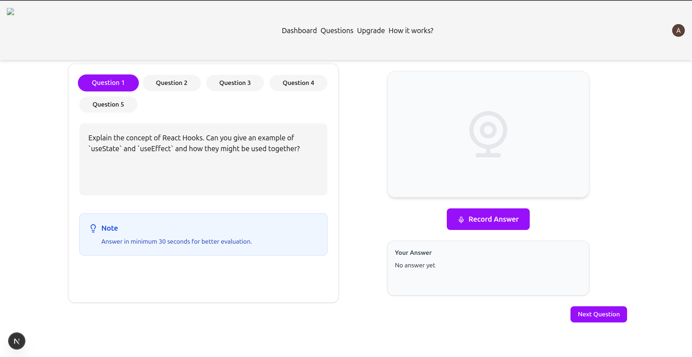
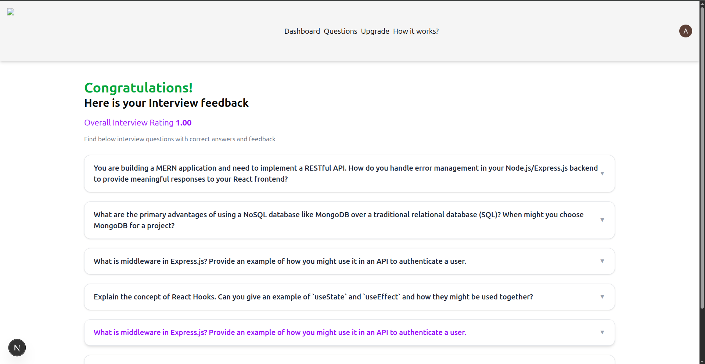
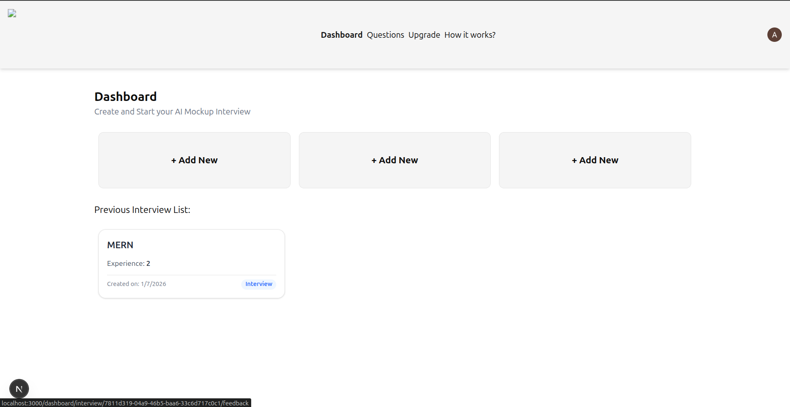

# 🤖 AI Mock Interview Platform

An **AI-powered mock interview web application** that simulates real technical interviews, records user answers, evaluates them using AI, and provides **structured feedback, correct answers, and ratings**. This project is designed to help students and developers prepare for **MERN / Frontend / Backend interviews** in an interactive way.

---

## 🚀 Features

### 🧠 AI-Driven Interview

- Dynamically generated interview questions based on **technology stack and experience level**
- Supports **multi-question interview flow**
- AI-generated **ideal answers** for comparison

### 🎙️ Voice Answer Recording

- Record answers using microphone (Speech-to-Text)
- Minimum answer duration enforced for better evaluation
- Stores user responses securely

### 📊 Smart Evaluation & Feedback

- AI evaluates answers and provides:

  - Correct / Ideal Answer
  - Personalized feedback
  - Per-question rating

- **Overall interview rating** calculated

### 📁 Interview History

- View **previous interviews** from dashboard
- Resume or review completed interviews
- Clean and intuitive UI for navigation

### 🧩 Modular Interview Flow

- Question navigation (Next / Previous)
- Separate interview start, answer recording, and feedback pages

### 🔐 Authentication Ready

- Integrated authentication configuration
- Secure access to user-specific interview data

---

## 🛠️ Tech Stack

### Frontend

- **Next.js 14 (App Router)**
- **React.js**
- **Tailwind CSS**
- **Shadcn/UI components**

### Backend

- **Next.js Server Actions**

### Database

- **MySQL**
- **Drizzle ORM**
- Schema-based structured data storage

### AI Integration

- **Google Gemini API**
- Used for:

  - Question generation
  - Answer evaluation
  - Feedback & rating

### Utilities & Tools

- Speech Recognition API (Browser)
- UUID for interview sessions
- Environment-based configuration

---

## 📂 Project Structure

```
app/
 ├── (auth)/            # Authentication routes
 ├── actions/           # Server actions (DB + AI logic)
 ├── dashboard/         # Dashboard & interview flow
 │   ├── interview/     # Interview pages
 │   │   ├── start/     # Question & recording UI
 │   │   └── feedback/  # Interview feedback summary
 ├── components/ui/     # Reusable UI components
 ├── globals.css
 ├── layout.js
 └── page.js

db/
 ├── index.js           # DB connection
 └── schema.js          # Drizzle schema

utils/
 ├── gemineAPI.js       # Gemini AI integration
 └── getDBSetting.js

.env                    # Environment variables
```

---

## 🧪 Database Tables (Example)

- **Interview** – Interview metadata
- **Questions** – Generated questions
- **QuestionAndFeedback** – User answers, AI feedback, rating

---

## ⚙️ Environment Variables

Create a `.env` file:

```env
NEXT_PUBLIC_GEMINI_API_KEY=your_gemini_api_key
DATABASE_URL=mysql_connection_string
```

---

## ▶️ Getting Started

### 1️⃣ Clone the repository

```bash
git clone https://github.com/your-username/ai-mock-interview.git
cd ai-mock-interview
```

### 2️⃣ Install dependencies

```bash
npm install
```

### 3️⃣ Run database migrations (Drizzle)

```bash
npx drizzle-kit push
```

### 4️⃣ Start the development server

```bash
npm run dev
```

App will run on: **[http://localhost:3000](http://localhost:3000)**

---

## 📸 Screenshots

### 🏠 Dashboard



### 🎤 Interview – Question & Recording



### 🧠 AI Feedback & Rating



### 📜 Interview History



---

## 📸 Application Flow

1. User creates a new interview
2. Selects tech stack & experience
3. AI generates interview questions
4. User records answers
5. AI evaluates responses
6. Detailed feedback & rating shown

---

## 🎯 Future Enhancements

- Resume-based question generation
- Video answer recording
- Admin dashboard
- Export interview reports (PDF)
- Company-specific interview modes

---

## 👨‍💻 Author

**Ayush Raut**
Engineering Student | Full Stack Developer

---

## ⭐ Support

If you find this project helpful, please ⭐ the repository and share it!
